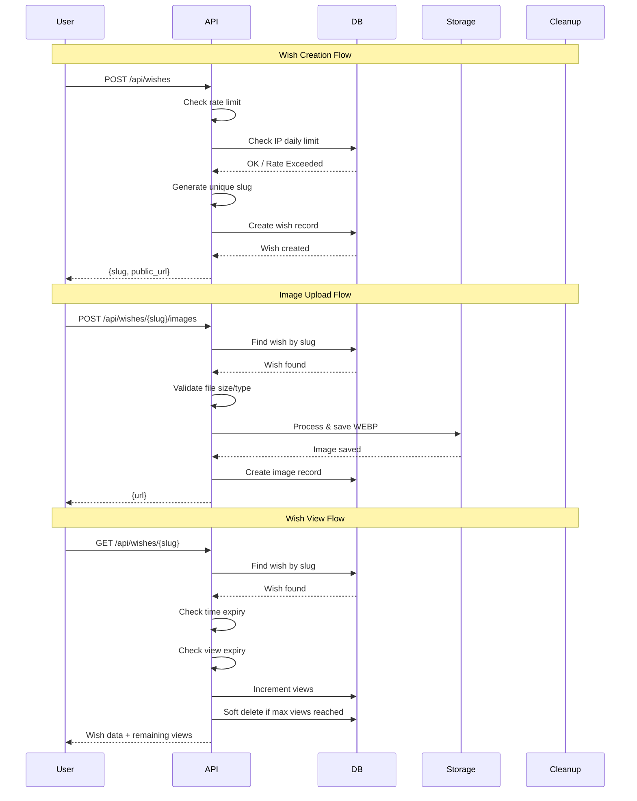

# Wishaday MVP - Backend Implementation Plan

## Overview
This document outlines the implementation plan for the Wishaday MVP backend based on the specification provided. The system will be built with FastAPI, SQLAlchemy, and SQLite for local development.

## Project Structure
```
D:\Python-25\Wish-A-Day\
├── app/
│   ├── __init__.py
│   ├── main.py                    # FastAPI application entry point
│   ├── config.py                  # Configuration settings
│   ├── database.py                # Database connection and session management
│   ├── models.py                  # SQLAlchemy ORM models
│   ├── schemas.py                 # Pydantic schemas
│   ├── routes/
│   │   ├── __init__.py
│   │   ├── wishes.py              # Wish-related endpoints
│   │   └── uploads.py             # Image upload endpoints
│   ├── services/
│   │   ├── __init__.py
│   │   ├── slug.py                # Slug generation service
│   │   ├── image.py               # Image processing service
│   │   ├── expiry.py              # Expiry checking service
│   │   └── cleanup.py             # Cleanup job for deleted records
│   └── uploads/
│       └── wishes/                # Image storage directory
├── tests/
│   ├── __init__.py
│   ├── conftest.py                # Test configuration
│   ├── test_wishes.py             # Unit tests for wishes
│   └── test_images.py             # Unit tests for image processing
├── scripts/
│   └── init_db.py                 # Database initialization script
├── pyproject.toml                 # Project configuration and dependencies
├── .env.example                   # Environment variables template
├── .gitignore
└── README.md                      # Project documentation
```

## Implementation Details

### 1. Configuration (app/config.py)
- Load settings from environment variables
- Provide defaults for development
- Settings include:
  - `DATABASE_URL`: SQLite connection string
  - `UPLOAD_DIR`: Path to store uploaded images
  - `MAX_FILE_SIZE`: Maximum upload file size (2MB)
  - `MAX_IMAGES_PER_WISH`: Maximum images per wish (5)
  - `MAX_WISHES_PER_IP_PER_DAY`: Rate limiting (10)
  - `CLEANUP_INTERVAL_MINUTES`: Cleanup job frequency (30)
  - `SOFT_DELETE_GRACE_PERIOD_MINUTES`: Time before hard delete (10)
  - `BASE_URL`: Public base URL for shareable links

### 2. Database Models (app/models.py)

#### Wish Model
```python
class Wish(Base):
    id: Mapped[int] = Column(Integer, primary_key=True, autoincrement=True)
    slug: Mapped[str] = Column(String(10), unique=True, nullable=False, index=True)
    title: Mapped[Optional[str]] = Column(String(255), nullable=True)
    message: Mapped[str] = Column(Text, nullable=False)
    theme: Mapped[str] = Column(String(50), default="default")
    expires_at: Mapped[Optional[datetime]] = Column(DateTime(timezone=True), nullable=True)
    max_views: Mapped[Optional[int]] = Column(Integer, nullable=True)
    current_views: Mapped[int] = Column(Integer, default=0)
    is_deleted: Mapped[bool] = Column(Boolean, default=False)
    created_at: Mapped[datetime] = Column(DateTime(timezone=True), default=func.now())
    deleted_at: Mapped[Optional[datetime]] = Column(DateTime(timezone=True), nullable=True)
    ip_hash: Mapped[str] = Column(String(64), nullable=False)  # For rate limiting
```

#### WishImage Model
```python
class WishImage(Base):
    id: Mapped[int] = Column(Integer, primary_key=True, autoincrement=True)
    wish_id: Mapped[int] = Column(Integer, ForeignKey("wishes.id", ondelete="CASCADE"))
    path: Mapped[str] = Column(String(500), nullable=False)  # Relative path
    created_at: Mapped[datetime] = Column(DateTime(timezone=True), default=func.now())
```

### 3. Pydantic Schemas (app/schemas.py)

#### Request Schemas
```python
class WishCreate(BaseModel):
    title: Optional[str] = Field(None, max_length=255)
    message: str = Field(..., min_length=1, max_length=5000)
    theme: str = Field(default="default", max_length=50)
    expires_at: Optional[datetime] = None
    max_views: Optional[int] = Field(None, ge=1, le=1000)

class ImageUpload(BaseModel):
    file: UploadFile  # FastAPI UploadFile
```

#### Response Schemas
```python
class WishCreateResponse(BaseModel):
    slug: str
    public_url: str

class WishViewResponse(BaseModel):
    title: Optional[str]
    message: str
    theme: str
    images: List[str]
    remaining_views: Optional[int]

class ImageUploadResponse(BaseModel):
    url: str
```

### 4. Services

#### Slug Generation Service (app/services/slug.py)
- Use `nanoid` library
- Generate 8-10 character slugs
- Check for uniqueness in database
- Retry up to 3 times if slug exists

#### Image Processing Service (app/services/image.py)
```python
def process_image(file: UploadFile) -> str:
    """Process uploaded image and save as WEBP."""
    # 1. Validate file type (allow common image formats)
    # 2. Validate file size (< 2MB)
    # 3. Read image with Pillow
    # 4. Convert to RGB if necessary
    # 5. Convert to WEBP format
    # 6. Strip metadata (EXIF, etc.)
    # 7. Save to upload directory
    # 8. Return relative path
```

#### Expiry Service (app/services/expiry.py)
```python
def check_expiry(wish: Wish) -> Tuple[bool, str]:
    """Check if a wish has expired.
    
    Returns:
        Tuple of (is_expired, reason)
    """
    # Check time-based expiry
    if wish.expires_at and datetime.utcnow() > wish.expires_at:
        return True, "time"
    
    # Check view-based expiry
    if wish.max_views and wish.current_views >= wish.max_views:
        return True, "views"
    
    return False, ""
```

#### Cleanup Service (app/services/cleanup.py)
- Run as background task
- Delete wishes where `is_deleted=True` and `deleted_at` older than grace period
- Remove associated image files
- Log cleanup actions

### 5. API Routes

#### Wishes Router (app/routes/wishes.py)

##### POST /api/wishes - Create Wish
```python
@router.post("/wishes", response_model=WishCreateResponse)
async def create_wish(wish_data: WishCreate, request: Request):
    """Create a new wish with optional expiry settings."""
    # 1. Get client IP
    # 2. Check rate limit (max 10 wishes per IP per day)
    # 3. Generate unique slug
    # 4. Create wish record
    # 5. Return slug and public URL
```

##### GET /api/wishes/{slug} - View Wish
```python
@router.get("/wishes/{slug}", response_model=WishViewResponse)
async def view_wish(slug: str):
    """View a wish (public endpoint)."""
    # 1. Find wish by slug
    # 2. Check if not found or soft-deleted → 404
    # 3. Check time-based expiry → mark deleted → 410
    # 4. Increment view count
    # 5. Check view-based expiry → mark deleted after response
    # 6. Load associated images
    # 7. Calculate remaining views
    # 8. Return wish data
```

#### Uploads Router (app/routes/uploads.py)

##### POST /api/wishes/{slug}/images - Upload Image
```python
@router.post("/wishes/{slug}/images", response_model=ImageUploadResponse)
async def upload_image(slug: str, file: UploadFile = File(...)):
    """Upload an image for a wish."""
    # 1. Find wish by slug
    # 2. Check if wish exists and not deleted
    # 3. Check max images per wish (5)
    # 4. Validate file type and size
    # 5. Process image (WEBP conversion, strip metadata)
    # 6. Save image record
    # 7. Return URL
```

### 6. Rate Limiting (app/middleware/rate_limit.py)
- Track wishes per IP per day using Redis or in-memory cache
- Simple implementation: use `fastapi-limiter` or custom middleware
- Reject requests exceeding limit with 429 status

### 7. Main Application (app/main.py)
```python
from fastapi import FastAPI
from fastapi.staticfiles import StaticFiles
from contextlib import asynccontextmanager

@asynccontextmanager
async def lifespan(app: FastAPI):
    """Startup and shutdown events."""
    # Startup: initialize database
    init_db()
    # Start cleanup background task
    yield
    # Shutdown: cleanup if needed

app = FastAPI(lifespan=lifespan)
app.include_router(wishes_router)
app.include_router(uploads_router)
app.mount("/media", StaticFiles(directory="app/uploads"), name="media")
```

## Database Initialization

### Table Creation
```python
# app/database.py
from sqlalchemy import create_engine
from sqlalchemy.orm import declarative_base
from sqlalchemy.orm import sessionmaker

SQLALCHEMY_DATABASE_URL = "sqlite:///./wishaday.db"
engine = create_engine(SQLALCHEMY_DATABASE_URL, connect_args={"check_same_thread": False})
SessionLocal = sessionmaker(autocommit=False, autoflush=False, bind=engine)
Base = declarative_base()

def init_db():
    Base.metadata.create_all(bind=engine)
```

## Dependencies (pyproject.toml)
```toml
[project]
name = "wishaday"
version = "0.1.0"
description = "A wish sharing platform with self-destructing wishes"
requires-python = ">=3.11"
dependencies = [
    "fastapi>=0.109.0",
    "uvicorn[standard]>=0.27.0",
    "sqlalchemy>=2.0.25",
    "pydantic>=2.5.3",
    "pydantic-settings>=2.1.0",
    "python-multipart>=0.0.6",
    "python-dotenv>=1.0.0",
    "nanoid>=2.0.1",
    "Pillow>=10.2.0",
    "apscheduler>=3.10.4",
]

[project.optional-dependencies]
dev = [
    "pytest>=7.4.4",
    "pytest-asyncio>=0.23.3",
    "httpx>=0.26.0",
    "black>=24.1.1",
    "isort>=5.13.2",
    "mypy>=1.8.0",
]

[tool.pytest.ini_options]
asyncio_mode = "auto"
testpaths = ["tests"]

[tool.black]
line-length = 100
target-version = ["py311"]

[tool.isort]
profile = "black"
line_length = 100
```

## Testing Strategy

### Unit Tests (tests/)
- Test slug generation uniqueness
- Test image processing (WEBP conversion, size limits)
- Test expiry logic (time-based, view-based)
- Test schema validation

### Integration Tests (tests/)
- Test full wish creation flow
- Test image upload flow
- Test wish viewing and expiry
- Test rate limiting

### Test Fixtures (tests/conftest.py)
- In-memory SQLite database
- Sample images for upload testing
- Test client fixture

## Environment Variables (.env.example)
```env
# Database
DATABASE_URL=sqlite:///./wishaday.db

# Upload Configuration
UPLOAD_DIR=./app/uploads
MAX_FILE_SIZE=2097152
MAX_IMAGES_PER_WISH=5

# Rate Limiting
MAX_WISHES_PER_IP_PER_DAY=10

# Cleanup Configuration
CLEANUP_INTERVAL_MINUTES=30
SOFT_DELETE_GRACE_PERIOD_MINUTES=10

# Server Configuration
BASE_URL=http://localhost:8000
DEBUG=true

# Security
SECRET_KEY=your-secret-key-here
```

## Running the Application

### Development
```bash
# Install dependencies
pip install -e ".[dev]"

# Initialize database
python scripts/init_db.py

# Run development server
uvicorn app.main:app --reload --port 8000
```

### Testing
```bash
# Run all tests
pytest -v

# Run with coverage
pytest --cov=app --cov-report=html
```

## Mermaid: Request Flow Diagram



## Next Steps

Once this plan is approved, I'll switch to Code mode to implement:
1. Project structure and configuration
2. Database models and schemas
3. Core services
4. API routes
5. Tests and documentation